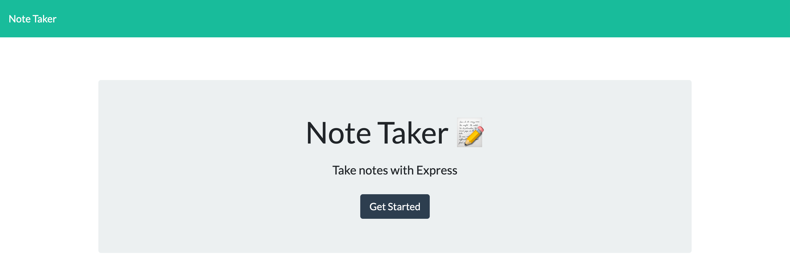

# note-taker
  
  ## Description
  This application is used to write, save and delete notes.  It uses HTML5 and CSS3 on the front end, while using Express.js on the back end. The application is deployed on Heroku.
  ## Table of Contents
  - [Installation](#installation)
  - [Usage](#usage)
  - [Questions](#questions)
  - [License](#license)
  - [Contribution](#contribution)
  - [Tests](#tests)
  ## Installation
  The application is deployed live at https://warm-wildwood-39670.herokuapp.com/
  
  The github repository is at https://github.com/ctolnai/note-taker
  ## Usage
  
  
  ## Questions
  https://github.com/ctolnai

  Please email me at christolnai@gmail.com for any questions.
  ## License
  This application is licensed under Apache
  ## Contribution
  Pull requests are welcome. For major changes, please open an issue first to discuss what you would like to change.
  ## Tests
  N/A